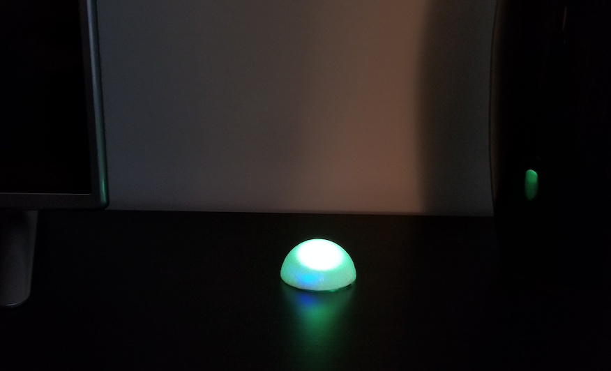
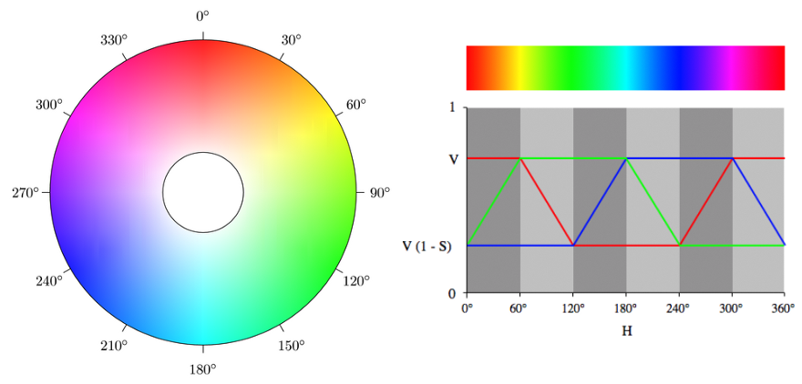

# arduino-thc
Arduino BLE Time Hacker Clock

A Time Hacker Clock is a device based on the Time Hacker Method (THM). THM combines simple productivity guidelines with devices that emit shapes or colors to quickly convey how much time remains in a given day or time block.

This version of the clock uses an Ardunio based microcontroller to light a plastic dome.

The colors used are from the [HSV color space](https://en.wikipedia.org/wiki/HSL_and_HSV), essentially the colors from green to red in a 120-degree range.  A green light represents having more available time and a red light indicates the available time is expiring.

The clock is powered by a small battery and controlled using a mobile app (Android / iOS) via Bluetooth.

## Build your own device

Review these docs to build your own version.

* [Build device](./docs/build.md)
* [Software setup](./docs/software.md)
* [Controlling the clock](./docs/controlling.md)

