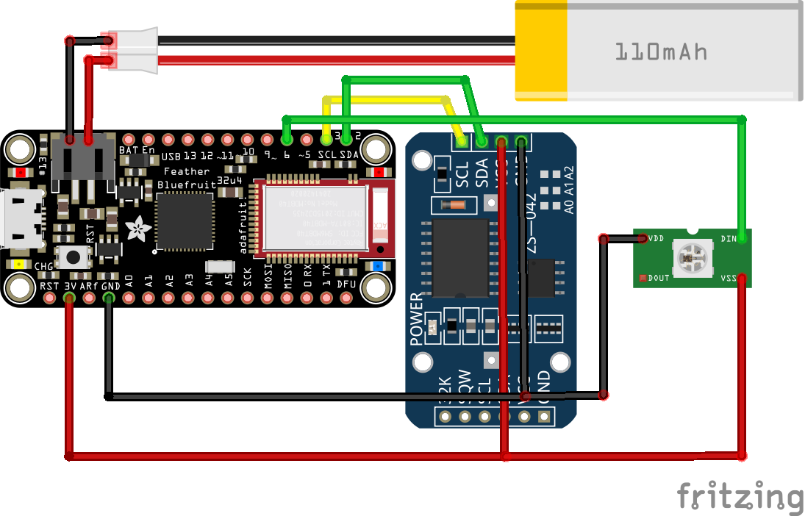

# arduino-thc
Arduino BLE Time Hacker Clock

A Time Hacker Clock is a device based on the Time Hacker Method (THM). THM combines simple productivity guidelines with devices that emit shapes or colors to quickly convey how much time remains in a given day or time block.


## Features

* Bluetooth BLE, constrollable via mobile phone
* Realtime clock
* Support for various NeoPixel lighting modules

## Design



## Parts

* [Adafruit Feather 32u4 Bluefruit LE](https://www.adafruit.com/product/2829)
* Adafruit NeoPixels. Works with RGB/RGBW strings and rings:
  * [NeoPixel 5050 RGB LED](https://www.adafruit.com/product/1655 )
  * [NeoPixel Stick - 8 x 5050 RGB LED](https://www.adafruit.com/product/1426)
  * [NeoPixel Ring - 12 x 5050 RGB LED](https://www.adafruit.com/product/1643)
  * [NeoPixel Ring - 12 x 5050 RGBW LED](https://www.adafruit.com/product/2853)
  * [NeoPixel Ring - 16 x 5050 RGB LED](https://www.adafruit.com/product/1463)
  * [NeoPixel FeatherWing - 4x8 RGB LED](https://www.adafruit.com/product/2945)
* [Adafruit DS3231 Precision RTC Breakout](https://www.adafruit.com/product/3013)
* Enclosures:
  * [Eightwood Aluminum Enclosure Electronic Project Box DIY Black -2.95" x 2.75" x 0.94](http://a.co/d/7EzhH0J)
  * [Belleman Plastic Box (WCAH2855) 85 x 55 x 30 mm](https://www.velleman.eu/products/view/?id=17840)
  * https://www.allelectronics.com/item/1551-fbk/pocket-size-project-box/1.html

## Software

In the Ardunio IDE

"From the Sketch menu, > Include Library > Manage Libraries...  In the text input box type in "NeoPixel". Look for "Adafruit NeoPixel by Adafruit" and select the latest version by clicking on the dropbox menu next to the Install button"
More on the Adafruit website: https://learn.adafruit.com/adafruit-neopixel-uberguide/arduino-library-installation

### Third party Bluetooth mobile apps

The Ardunio THC can be controlled using anyone of several third party mobile app.

#### Android phone controller app
* https://play.google.com/store/apps/details?id=de.kai_morich.serial_bluetooth_terminal
* https://play.google.com/store/apps/details?id=com.adafruit.bluefruit.le.connect

#### iOS phone controller app
* https://learn.adafruit.com/bluefruit-le-connect-for-ios
* LightBlue Explorer: https://itunes.apple.com/us/app/lightblue/id557428110

#### Supported commands

THC commands consist of three letter names optionally preceeded by one or more parameters.

Commands are submitted via one of the above mobile applications via the UART terminal.

**Get date**

Get the date set on the THC device.

```shell
gtd
```

**Get time**

Get the current time on the THC realtime clock. You must do this when powering up your THC for the first time and when it becomes time to replace the THC battery. A xxxx battery should last about a year.

```shell
gtm
```

**Set clock**

Set the current date and time.

```shell
sck 20181001 080206
```

Date time is in `yyyymmdd hhmmss` format.
Each field must be 2 digit and perceeded with a zero if necessary. The year is always a 4 digit field.

Time must be in a 24 hour clock format.

**Set time block range**

Set the duration of a time block by specifying a start hour and end hour.
Each field must be 2 digit and perceeded with a zero if necessary.
Time must be in a 24 hour clock format.

```shell
srg 05 20
```

The above example sets a time block range from 5am to 8pm.

**Get version**

Get the THC software version.

```shell
ver
```

