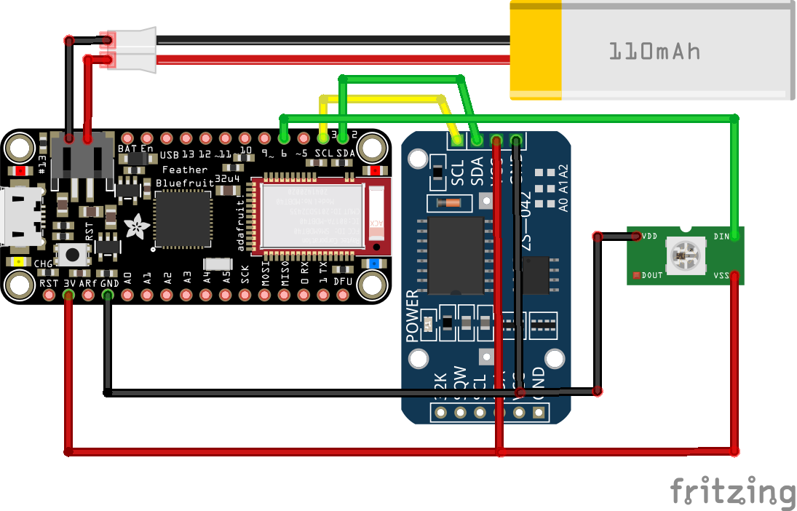

# Build instructions

## Design

I tested the design with various NeoPixels from Adafruit and they all worked well. I ultimately settled on a single WS2812B module which is lower costs and uses less power than an array of LEDS.

The realtime clock I chose was the `Adafruit DS3231 Precision RTC Breakout` so it's not exactly the one shown on the diagram above.

## Parts

* [Adafruit Feather 32u4 Bluefruit LE](https://www.adafruit.com/product/2829)
* [Adafruit DS3231 Precision RTC Breakout](https://www.adafruit.com/product/3013)
  * [CR1220 Lithium Battery](https://www.adafruit.com/product/380) used to keep date/time when clock is powered down.
* AlitoveE [WS2812B LED](http://a.co/d/adx7A64) Matrix
  * Alternative lights: Adafruit NeoPixels.
    * [NeoPixel 5050 RGB LED](https://www.adafruit.com/product/1655 )
    * [NeoPixel Stick - 8 x 5050 RGB LED](https://www.adafruit.com/product/1426)
    * [NeoPixel Ring - 12 x 5050 RGB LED](https://www.adafruit.com/product/1643)
    * [NeoPixel Ring - 12 x 5050 RGBW LED](https://www.adafruit.com/product/2853)
    * [NeoPixel Ring - 16 x 5050 RGB LED](https://www.adafruit.com/product/1463)
    * [NeoPixel FeatherWing - 4x8 RGB LED](https://www.adafruit.com/product/2945)
* Enclosure:
  * [Franklin Sports 70mm Aero-Strike Plastic Baseball](http://a.co/d/iwid0SK)
  * Others:
    * [Eightwood Aluminum Enclosure Electronic Project Box DIY Black -2.95" x 2.75" x 0.94](http://a.co/d/7EzhH0J)
    * [Belleman Plastic Box (WCAH2855) 85 x 55 x 30 mm](https://www.velleman.eu/products/view/?id=17840)
    * https://www.allelectronics.com/item/1551-fbk/pocket-size-project-box/1.html
* Battery power (optional):
  * [Lithium Ion Polymer Battery - 3.7v 100mAh - 2500mAh](https://www.adafruit.com) used operate clock without an external power source.

---

[Return to main](../README.md) | [Build device](../docs/build.md) | [Software setup](../docs/software.md) | [Controlling the clock](../docs/controlling.md)
